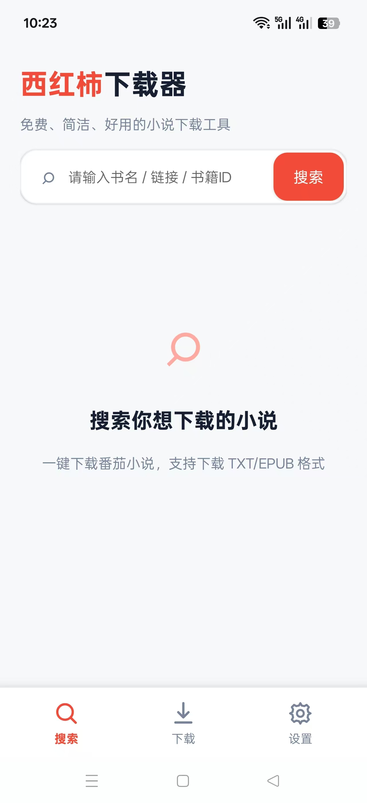
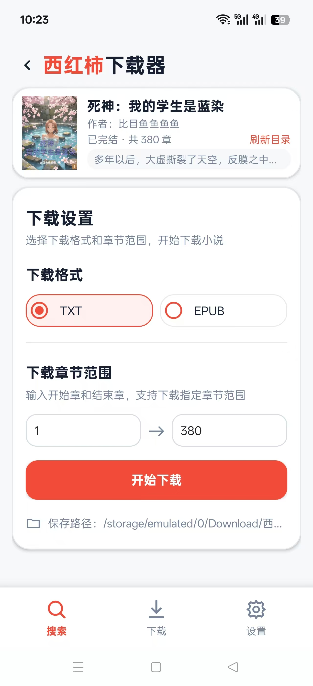

# 西红柿下载器 / Fanqie_downloader

安卓手机番茄小说搜索与下载工具，支持TXT/EPUB、章节范围选择、下载进度、下载目录设置和缓存管理等。

## 下载与安装

前往 [GitHub Releases](https://github.com/2857865859/tomato_downloader/releases/latest) 下载正式版 APK。

当前正式版：**1.0.1**。支持 Android 8.0（API 26）及以上。

1. 下载 `tomato_downloader-v1.0.1.apk`。
2. 在 Android 设备上打开 APK，按系统提示安装。
3. 搜索书名、书籍链接或书籍 ID，在详情页选择章节范围与 TXT / EPUB 格式。
4. 可以在下载页管理任务，在设置页选择保存目录。

## 软件截图

  
  
  

